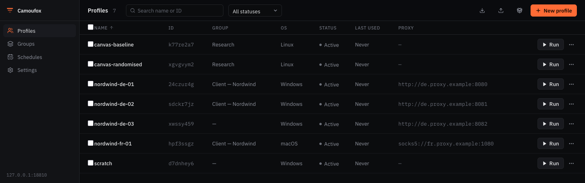

# Camoufox Profile Manager

[](https://github.com/polyackiy/camoufox-profile-manager/actions/workflows/ci.yml)
[](LICENSE)
[](https://www.python.org/downloads/)
[](https://github.com/daijro/camoufox)

A self-hosted, open-source manager for [Camoufox](https://github.com/daijro/camoufox)
antidetect browser profiles. Create and organize browser profiles with realistic,
consistent fingerprints, launch them on demand, and drive everything through a REST
API or a web interface — a free alternative to commercial tools like AdsPower,
Multilogin, or GoLogin.

> **Status:** early release (`v0.1.0`). The core works and is tested; expect the
> occasional rough edge and API changes before `1.0`.



## Features

- **Profiles & groups** — full CRUD, cloning, bulk operations, search, and pagination.
- **Realistic fingerprints** — Camoufox generates consistent fingerprints; the
  manager sets high-level constraints (OS, screen, region → locale/timezone/geo,
  hardware) and lets the browser own the details.
- **Browser control** — launch, monitor, and close Camoufox sessions per profile.
- **Proxy support** — HTTP/HTTPS/SOCKS proxies; passwords encrypted at rest.
- **Excel import/export** — manage profiles in bulk via `.xlsx`.
- **REST API + web UI** — FastAPI backend with OpenAPI docs and a Next.js frontend.
- **Optional Chrome migration** — import cookies/history from your own Chrome
  profiles (see [`extras/chrome_migration`](extras/chrome_migration/README.md)).

## Requirements

- Python 3.10+ and [uv](https://docs.astral.sh/uv/)
- Node.js 20+ (for the web interface)

## Quick start

### Docker (easiest)

If you have Docker, run the whole stack with one command:

```bash
docker compose up
```

Then open **http://localhost:3000**. Profile data persists in a Docker volume.
(Launching real browsers inside a container needs a virtual display — see
[docs/accessibility-roadmap.md](docs/accessibility-roadmap.md); profile
management and the UI work out of the box.)

### Single command (`camoufox-pm`)

Run the API **and** the web UI as one process on one port — no separate Node
server at runtime. Build the UI once (needs Node), then launch:

```bash
uv sync
python scripts/build_webui.py     # builds the UI into the package (once)
uv run camoufox-pm                # serves API + UI at http://localhost:8000
```

`camoufox-pm` opens your browser automatically. The UI is served from the same
origin as the API, so there is no proxy or CORS to configure.

Prefer a prebuilt package? Each [release](https://github.com/polyackiy/camoufox-profile-manager/releases)
attaches a wheel with the UI already bundled, so you can skip the Node build step:

```bash
pip install <wheel-url-from-releases>
camoufox-pm
```

### Backend (API)

```bash
# Install dependencies
uv sync

# Download the Camoufox browser binary (first run only)
uv run camoufox fetch

# (optional) seed some demo profiles
uv run python examples/seed_demo.py

# Start the API on http://127.0.0.1:8000 (docs at /docs)
uv run python -m camoufox_pm.main
```

### Frontend (web UI)

```bash
cd web
npm install
npm run dev   # http://localhost:3000
```

The web UI proxies API calls to the backend, so no CORS setup is needed in
development. It expects the API on `http://localhost:8000` by default; if your
API runs elsewhere, set `API_PROXY_TARGET` before building/starting the web app:

```bash
API_PROXY_TARGET=http://localhost:8123 npm run build && npm start
```

## Configuration

Settings come from environment variables (prefix `CPM_`). Copy `.env.example` to
`.env` and edit as needed.

| Variable           | Default                  | Description                                   |
| ------------------ | ------------------------ | --------------------------------------------- |
| `CPM_HOST`         | `127.0.0.1`              | API bind address                              |
| `CPM_PORT`         | `8000`                   | API port                                      |
| `CPM_CORS_ORIGINS` | `http://localhost:3000`  | Comma-separated allowed origins               |
| `CPM_API_KEY`      | *(empty)*                | If set, required as the `X-API-Key` header    |
| `CPM_DB_PATH`      | `data/profiles.db`       | SQLite database path                          |
| `CPM_SECRET_KEY`   | *(empty)*                | Fernet key to encrypt proxy passwords at rest |

## Architecture

```
src/camoufox_pm/
├── main.py            # FastAPI app
├── config.py          # environment-based settings
├── core/              # models, database, profile & browser-session managers
└── api/               # routes, request/response models, middleware
web/                   # Next.js web interface
extras/chrome_migration/  # optional Chrome → Camoufox migration
```

- **Backend:** Python, FastAPI, SQLite, Camoufox + Playwright.
- **Frontend:** Next.js 15, React 19, TypeScript, Tailwind.

## Development

See [CONTRIBUTING.md](CONTRIBUTING.md). In short:

```bash
uv sync --extra dev
uv run ruff check src tests
uv run mypy src/camoufox_pm
uv run pytest -m "not browser"
```

The roadmap lives in [docs/roadmap.md](docs/roadmap.md).

## Disclaimer

This tool is for lawful use only — for example testing, privacy, and managing
multiple accounts in accordance with each site's terms of service. You are
responsible for how you use it. Antidetect browsing does not make any activity
that would otherwise be against a service's rules acceptable.

## License

[MIT](LICENSE) © Camoufox Profile Manager Contributors.

Built on [Camoufox](https://github.com/daijro/camoufox) by daijro.

---

Русская версия: [README.ru.md](README.ru.md).
