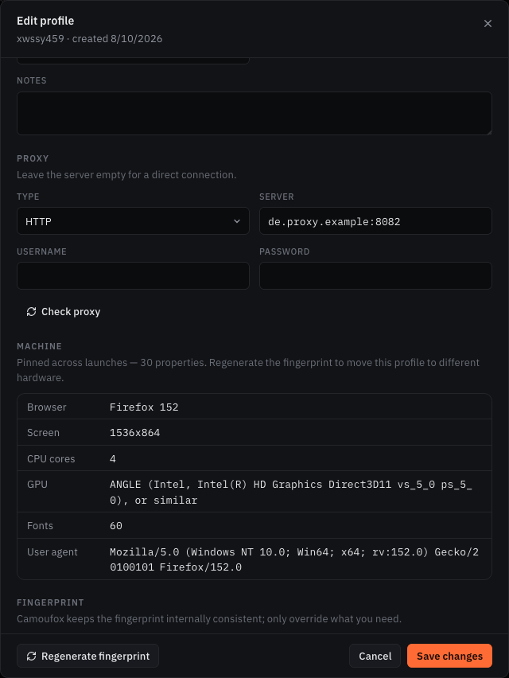
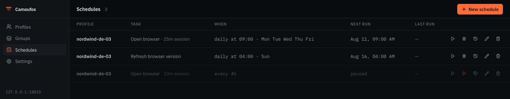
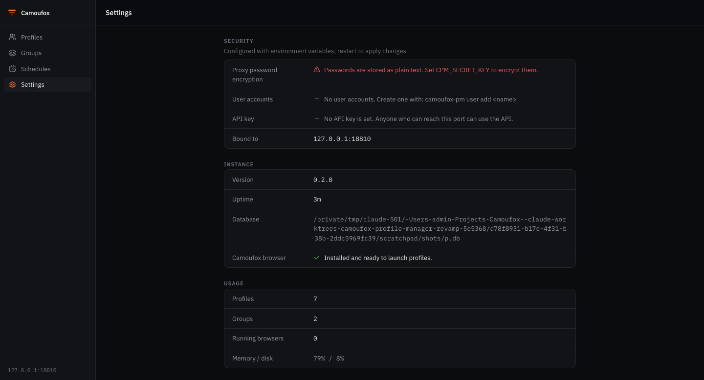

# Camoufox Profile Manager

[](https://github.com/polyackiy/camoufox-profile-manager/actions/workflows/ci.yml)
[](LICENSE)
[](https://www.python.org/downloads/)
[](https://github.com/daijro/camoufox)

Self-hosted менеджер профилей антидетект-браузера
[Camoufox](https://github.com/daijro/camoufox) с открытым исходным кодом —
бесплатная альтернатива AdsPower, Dolphin, Multilogin и GoLogin для тех, кто
предпочитает держать всё у себя.

Каждый профиль — **одна долгоживущая машина**. Он сохраняет один и тот же
фингерпринт от запуска к запуску вместе со своими куками, хранилищем и историей,
так что аккаунт, открытый с него в январе, в июне выглядит с того же компьютера.

> **Статус:** `v0.2.0`, рабочее состояние. 392 теста, 20 из которых запускают
> настоящий браузер и проверяют, что видит страница; покрытие 90%. REST API
> версионирован как `/api/v1` и имеет письменный
> [контракт стабильности](docs/api.md#stability-contract), а каждый релиз перед
> публикацией ставится из собственного колеса и запускается.
>
> Две вещи, которые стоит знать заранее. В `1.0` уйдут поля, помеченные в этом
> контракте как deprecated. И [миграция из
> Chrome](extras/chrome_migration/README.md) — отдельный экспериментальный
> модуль: его Windows-путь написан по документированному формату Chrome, но ни
> разу не исполнялся на настоящем Windows-профиле.


## Что умеет

- **Профиль — одна и та же машина при каждом запуске.** Camoufox генерирует
  новый фингерпринт при каждом старте: для инструмента приватности это
  правильно, для долгоживущего аккаунта — наоборот. Первый запуск определяет
  фингерпринт один раз и сохраняет его, все последующие его воспроизводят.
  Геолокация, таймзона и WebRTC остаются динамическими и продолжают следовать за
  прокси. См. [docs/profile-settings.md](docs/profile-settings.md).
- **Фингерпринты реальных устройств.** Профиль можно создать из одного из 312
  фингерпринтов, снятых Camoufox с настоящих машин, а не из синтетического
  набора.
- **Профили и группы** — создание, правка, клонирование, удаление, поиск,
  фильтры, массовые операции и группировка по клиенту или назначению.
- **Управление браузером** — запуск и остановка браузера для каждого профиля;
  если вы закрыли окно сами, приложение это замечает и убирает сессию.
- **Расписания** — открытие профиля по расписанию (прогрев) и автоматическое
  обновление закреплённой версии браузера. Железо по таймеру не меняется
  никогда, и это сделано намеренно —
  [docs/scheduling.md](docs/scheduling.md).
- **Прокси, проверяемые до того, как им довериться.** HTTP, HTTPS и SOCKS;
  пароли шифруются при хранении, если задан `CPM_SECRET_KEY`. *Check proxy*
  показывает, где прокси реально выходит, и согласуется ли с этим профиль:
  таймзона, идущая по другим часам, чем страна выхода, — то противоречие,
  которое страница измеряет двумя строками JavaScript.
- **Несколько пользователей, когда нужно.** Для обычного случая настраивать
  нечего: приложение слушает loopback и открыто. Задайте `CPM_API_KEY` для
  машинных клиентов или заведите аккаунт (`camoufox-pm user add`) — и для людей
  появится экран входа: хеши argon2id, HttpOnly-куки сессии и выход, который
  действительно инвалидирует сессию.
- **Перенос профиля куда угодно.** Экспорт профиля вместе с фингерпринтом *и*
  данными браузера в один архив и импорт на другой машине.
- **Массовое редактирование через Excel** — [docs/excel.md](docs/excel.md).
- **REST API и веб-интерфейс** на одном порту в одном процессе.
- **Опциональная миграция из Chrome** — импорт куков и истории из ваших
  собственных профилей Chrome
  ([`extras/chrome_migration`](extras/chrome_migration/README.md)).

## Как это выглядит

<table>
<tr>
<td width="50%"></td>
<td width="50%">

**Закреплённая машина.** Именно она превращает профиль в аккаунт, а не в окно
браузера. Каждое значение здесь резолвится один раз и воспроизводится при каждом
запуске — экран, число ядер, строка GPU, набор шрифтов, user agent.
*Regenerate* переводит профиль на другое железо намеренно и говорит, чего это
стоит.

Профиль на снимке закреплён за одним из 312 устройств, снятых Camoufox с
настоящих машин, — то есть это существующая комбинация, а не сборка из
правдоподобных частей.

</td>
</tr>
</table>

| Работа по расписанию | Настройки инстанса |
| --- | --- |
|  |  |
| Прогревающие запуски и обновление версии браузера. Железо по таймеру не меняется — [почему](docs/scheduling.md). | Показывает действующую конфигурацию и предупреждает, если пароли прокси не шифруются или API открыт. |

## Установка и запуск

Нужны [uv](https://docs.astral.sh/uv/) и Python 3.10+. Node.js 20+ нужен только
если собираете веб-интерфейс сами.

### Из релиза (без Node.js)

В каждом [релизе](https://github.com/polyackiy/camoufox-profile-manager/releases)
лежит wheel с уже собранным интерфейсом внутри.

```bash
pip install <ссылка-на-wheel-из-релизов>
camoufox fetch     # скачивает браузер, ~300 МБ, только первый раз
camoufox-pm        # API и интерфейс на http://localhost:8000
```

### Из исходников

```bash
git clone https://github.com/polyackiy/camoufox-profile-manager.git
cd camoufox-profile-manager
uv sync
uv run camoufox fetch
uv run python scripts/build_webui.py    # сборка интерфейса в пакет (нужен Node)
uv run camoufox-pm
```

`camoufox-pm` сам открывает браузер. Интерфейс отдаётся с того же origin, что и
API, поэтому настраивать прокси или CORS не нужно. Все опции — в
[docs/cli.md](docs/cli.md).

### Как десктопное окно

```bash
uv sync --extra desktop
uv run camoufox-pm --desktop
```

Либо соберите самостоятельное приложение, которому не нужны ни Python, ни Node:
`python scripts/build_desktop.py`.

### Через Docker

```bash
docker compose up      # затем откройте http://localhost:8000
```

Один контейнер отдаёт API и интерфейс на одном порту — как и любой другой способ
запуска. Порт публикуется только на loopback. Для запуска настоящих браузеров
внутри контейнера нужен виртуальный дисплей; управление профилями, расписания и
интерфейс работают как есть.

## Первые шаги

1. Откройте приложение и нажмите **New profile**.
2. Выберите операционную систему и, при желании, **реальное устройство**, к
   которому профиль будет привязан. Оставьте поля фингерпринта пустыми —
   Camoufox сгенерирует согласованный набор.
3. Добавьте прокси, если он есть. Для прокси с логином и паролем берите
   HTTP/HTTPS: Firefox не умеет аутентификацию на SOCKS-прокси.
4. Нажмите **Run**. Строка профиля показывает его запущенным, пока вы не
   остановите его сами или не закроете браузер.

Экран **Settings** показывает, как настроен инстанс, и предупреждает, если пароли
прокси не зашифрованы или API доступен без ключа.

## Конфигурация

Настройки берутся из переменных окружения с префиксом `CPM_`. Скопируйте
`.env.example` в `.env` и отредактируйте под себя.

| Переменная         | По умолчанию            | Описание                                        |
| ------------------ | ----------------------- | ----------------------------------------------- |
| `CPM_HOST`         | `127.0.0.1`             | Адрес привязки                                  |
| `CPM_PORT`         | `8000`                  | Порт                                            |
| `CPM_DB_PATH`      | `data/profiles.db`      | Путь к базе SQLite                              |
| `CPM_SECRET_KEY`   | *(пусто)*               | Ключ Fernet; шифрует пароли прокси при хранении |
| `CPM_API_KEY`      | *(пусто)*               | Если задан, обязателен в заголовке `X-API-Key` (для машинных клиентов) |
| `CPM_SESSION_TTL_HOURS` | `168`              | Время жизни сессии входа, в часах               |
| `CPM_SECURE_COOKIES` | `0`                   | Принудительно ставит флаг `Secure` у cookie сессии (за TLS-прокси) |
| `CPM_CORS_ORIGINS` | `http://localhost:3000` | Разрешённые origin через запятую                |
| `CPM_WEBUI_DIR`    | *(авто)*                | Переопределяет, откуда отдаётся встроенный веб-интерфейс |

Ключ шифрования генерируется так:

```bash
uv run python -c "from cryptography.fernet import Fernet; print(Fernet.generate_key().decode())"
```

Учётные записи для веб-интерфейса заводятся из CLI: `camoufox-pm user add
<name>` создаёт запись, и с этого момента API и интерфейс требуют входа (см.
[SECURITY.md](SECURITY.md#authentication)).

## Документация

Вся документация ведётся на английском.

| Документ | О чём |
| -------- | ----- |
| [docs/cli.md](docs/cli.md) | Все команды и флаги |
| [docs/api.md](docs/api.md) | REST API, эндпоинт за эндпоинтом |
| [docs/profile-settings.md](docs/profile-settings.md) | Что делает каждая настройка, как устроено закрепление машины и чего Camoufox не умеет |
| [docs/scheduling.md](docs/scheduling.md) | Запуски по расписанию и обновление браузера, и почему ротации железа здесь нет |
| [docs/excel.md](docs/excel.md) | Массовый импорт и экспорт |
| [docs/accessibility-roadmap.md](docs/accessibility-roadmap.md) | План по выходу на нетехнических пользователей |
| [docs/releasing.md](docs/releasing.md) | Как выпускать релиз |
| [docs/signing.md](docs/signing.md) | Подпись десктопных сборок |
| [docs/roadmap.md](docs/roadmap.md) | Что запланировано |
| [CONTRIBUTING.md](CONTRIBUTING.md) | Как участвовать в разработке |
| [SECURITY.md](SECURITY.md) | Как сообщить об уязвимости |

## Измерено, а не предположено

Всё, что заявлено выше, проверялось на работающем браузере, и часть проверок дала
не тот результат, которого ждали. Измерения лежат в репозитории в виде тестов,
которые упадут, если поведение изменится:

| Что измеряли | Результат |
| --- | --- |
| Сохраняет ли незакреплённый профиль своё железо между запусками? | **Нет.** Один и тот же профиль показывал 1600x900, затем 3440x1440; 12, затем 32 ядра; GPU NVIDIA, затем AMD. Ради этого и сделан пиннинг. |
| Стабилен ли канвас для сайта между сессиями? | **По умолчанию нет** — стабилен внутри сессии и на сайт, но меняется при следующем запуске. `stable_canvas` это чинит ценой одинаковости между сайтами. Оба факта закреплены [браузерными тестами](tests/browser/test_fingerprint_stability.py). |
| Работает ли свойство `canvas:seed` в Camoufox? | **Нет.** Оно объявлено и доезжает до браузера, но не читается. Заведено апстримом: [daijro/camoufox#721](https://github.com/daijro/camoufox/issues/721) с воспроизведением. |
| Что происходит, если у профиля заданы координаты? | Отключается IP-резолв Camoufox, и Firefox начинает отдавать **таймзону хост-машины** — настоящая утечка, найденная чтением часов в живом браузере. Починено подстановкой этих значений самостоятельно. |

Тот же подход к коду: очистка, способная удалить все каталоги профилей, клоны с
общим отпечатком и релиз, сообщавший неверную версию, — всё это найдено
запуском, а не чтением. См. [CHANGELOG.md](CHANGELOG.md).

## Архитектура

```
src/camoufox_pm/
├── main.py             приложение FastAPI; отдаёт API и встроенный интерфейс
├── cli.py              команда camoufox-pm, включая учётные записи
├── config.py           настройки из переменных окружения
├── core/
│   ├── models.py            профили, группы, настройки браузера, расписания
│   ├── database.py          хранилище SQLite и миграции
│   ├── profile_manager.py   жизненный цикл профиля и управление браузером
│   ├── browser_session.py   запущенные браузеры
│   ├── fingerprint_store.py закрепление, обновление и пресеты реальных устройств
│   ├── fingerprint_generator.py  исходные ограничения нового профиля
│   ├── proxy_check.py       где выходит прокси и согласен ли с ним профиль
│   ├── scheduler.py         запуски и обновления браузера по расписанию
│   ├── profile_archive.py   экспорт и импорт профиля целиком
│   ├── excel_manager.py     массовый импорт и экспорт
│   ├── auth.py              хеширование паролей и сессии входа
│   ├── crypto.py            шифрование паролей прокси при хранении
│   └── cleanup.py           поиск и удаление осиротевших каталогов профилей
└── api/                роуты, модели, форма ошибок, middleware
web/                    веб-интерфейс на Next.js
extras/chrome_migration/  опциональная миграция Chrome → Camoufox
```

**Бэкенд:** Python, FastAPI, SQLite, Camoufox + Playwright.
**Фронтенд:** Next.js 15, React 19, TypeScript, Tailwind v4.

## Разработка

```bash
uv sync --extra dev
uv run ruff check src tests
uv run mypy src/camoufox_pm
uv run pytest -m "not browser"    # быстрый прогон
uv run pytest -m browser          # запускает настоящий браузер, нужен `camoufox fetch`
```

См. [CONTRIBUTING.md](CONTRIBUTING.md).

## Дисклеймер

Инструмент предназначен только для законного использования — например для
тестирования, приватности и управления несколькими аккаунтами в соответствии с
правилами каждого сервиса. Ответственность за использование лежит на вас.
Антидетект не делает допустимым то, что и так нарушает правила сервиса.

## Лицензия

[MIT](LICENSE) © Camoufox Profile Manager Contributors.

Построено на [Camoufox](https://github.com/daijro/camoufox) от daijro.

---

English version: [README.md](README.md).
