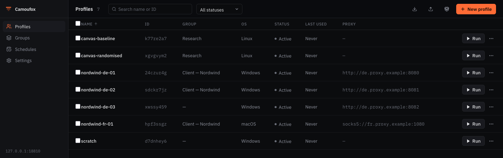

# Camoufox Profile Manager

[](https://github.com/polyackiy/camoufox-profile-manager/actions/workflows/ci.yml)
[](LICENSE)
[](https://www.python.org/downloads/)
[](https://github.com/daijro/camoufox)

Self-hosted менеджер профилей антидетект-браузера
[Camoufox](https://github.com/daijro/camoufox) с открытым исходным кодом —
бесплатная альтернатива AdsPower, Dolphin, Multilogin и GoLogin для тех, кто
предпочитает держать всё у себя.

Каждый профиль — **одна долгоживущая машина**. Он сохраняет один и тот же
фингерпринт от запуска к запуску вместе со своими куками, хранилищем и историей,
так что аккаунт, открытый с него в январе, в июне выглядит с того же компьютера.

> **Настольная предварительная версия:** [скачать v0.6.0-rc.1](https://github.com/polyackiy/camoufox-profile-manager/releases/tag/v0.6.0-rc.1), раздел **Assets**. CI собирает macOS Apple Silicon и Intel, Windows x64 и
> Ubuntu/Debian x64. Подпись включается при наличии сертификатов; неподписанные
> сборки могут вызвать предупреждение системы.
> [Начало работы](docs/getting-started.ru.md) / [English](docs/getting-started.md).
> Проверка установщиков на всех платформах и проверка подписи ещё продолжаются;
> [задачи до стабильного релиза](https://github.com/polyackiy/camoufox-profile-manager/milestone/1). Миграция Chrome остаётся экспериментальной.



## Что умеет

- **Профиль — одна и та же машина при каждом запуске.** Camoufox генерирует
  новый фингерпринт при каждом старте: для инструмента приватности это
  правильно, для долгоживущего аккаунта — наоборот. Первый запуск определяет
  фингерпринт один раз и сохраняет его, все последующие его воспроизводят.
  Геолокация, таймзона и WebRTC остаются динамическими и продолжают следовать за
  прокси. См. [docs/profile-settings.md](docs/profile-settings.md).
- **Фингерпринты реальных устройств.** Профиль можно создать из одного из 312
  фингерпринтов, снятых Camoufox с настоящих машин, а не из синтетического
  набора.
- **Профили и группы** — создание, правка, клонирование, удаление, поиск,
  фильтры, массовые операции и группировка по клиенту или назначению.
- **Управление браузером** — запуск и остановка браузера для каждого профиля;
  если вы закрыли окно сами, приложение это замечает и убирает сессию.
- **Расписания** — открытие профиля по расписанию (прогрев) и автоматическое
  обновление закреплённой версии браузера. Железо по таймеру не меняется
  никогда, и это сделано намеренно —
  [docs/scheduling.md](docs/scheduling.md).
- **Прокси, проверяемые до того, как им довериться.** HTTP, HTTPS и SOCKS;
  пароли шифруются при хранении, если задан `CPM_SECRET_KEY`. *Check proxy*
  показывает, где прокси реально выходит, и согласуется ли с этим профиль:
  таймзона, идущая по другим часам, чем страна выхода, — то противоречие,
  которое страница измеряет двумя строками JavaScript. Ответ остаётся в списке
  профилей — адрес выхода, страна и задержка под строкой прокси, зелёным,
  жёлтым или красным, — а выделенные профили проверяются одной кнопкой.
- **Несколько пользователей, когда нужно.** Для обычного случая настраивать
  нечего: приложение слушает loopback и открыто. Задайте `CPM_API_KEY` для
  машинных клиентов или заведите аккаунт (`camoufox-pm user add`) — и для людей
  появится экран входа: хеши argon2id, HttpOnly-куки сессии и выход, который
  действительно инвалидирует сессию.
- **Перенос профиля куда угодно.** Экспорт профиля вместе с фингерпринтом *и*
  данными браузера в один архив и импорт на другой машине.
- **Массовое редактирование через Excel** — [docs/excel.md](docs/excel.md).
- **REST API и веб-интерфейс** на одном порту в одном процессе.
- **Опциональная миграция из Chrome** — импорт куков и истории из ваших
  собственных профилей Chrome
  ([`extras/chrome_migration`](extras/chrome_migration/README.md)).

## Как это выглядит

<table>
<tr>
<td width="50%"></td>
<td width="50%">

**Закреплённая машина.** Именно она превращает профиль в аккаунт, а не в окно
браузера. Каждое значение здесь резолвится один раз и воспроизводится при каждом
запуске — экран, число ядер, строка GPU, набор шрифтов, user agent.
*Regenerate* переводит профиль на другое железо намеренно и говорит, чего это
стоит.

Профиль на снимке закреплён за одним из 312 устройств, снятых Camoufox с
настоящих машин, — то есть это существующая комбинация, а не сборка из
правдоподобных частей.

</td>
</tr>
</table>

| Работа по расписанию | Настройки инстанса |
| --- | --- |
|  |  |
| Прогревающие запуски и обновление версии браузера. Железо по таймеру не меняется — [почему](docs/scheduling.md). | Показывает действующую конфигурацию и предупреждает, если пароли прокси не шифруются или API открыт. |

## Установка и запуск

### Готовое приложение — рекомендуется

1. Откройте [Releases](https://github.com/polyackiy/camoufox-profile-manager/releases)
   и выберите установщик в **Assets**:

   | Компьютер | Файл |
   | --- | --- |
   | Mac, Apple Silicon (M1 и новее) | `camoufox-pm-macos-arm64.dmg` |
   | Mac, Intel | `camoufox-pm-macos-x86_64.dmg` |
   | Windows 10/11, Intel/AMD 64 бит | `camoufox-pm-windows-x86_64-setup.exe` |
   | Ubuntu 22.04+/совместимый Debian, Intel/AMD 64 бит | `camoufox-pm-linux-x86_64.deb` |

2. Установите и откройте **Camoufox Profile Manager**. Python, Node.js и терминал
   не нужны. На Mac сначала перенесите приложение в Applications.
3. Нажмите **Install browser**, дождитесь загрузки и создайте первый профиль.
   Приложение показывает ход установки и позволяет повторить её при ошибке.

В старых релизах могут быть только Python-пакеты. Если в релизе не указано
обратное, установщики не подписаны и macOS/Windows могут показать предупреждение.
[Краткое руководство](docs/getting-started.ru.md) объясняет установку, резервные
копии, Trash, обновления и расположение данных.

### Из исходников (для разработчиков)

Установите [uv](https://docs.astral.sh/uv/) и Node.js 20.9+. Python установит uv.

```bash
git clone https://github.com/polyackiy/camoufox-profile-manager.git
cd camoufox-profile-manager
uv sync --extra desktop
uv run python scripts/build_webui.py
uv run python -m camoufox_pm.desktop
```

Для запуска во вкладке браузера выполните `uv run camoufox-pm`. CLI по-прежнему
хранит данные в `data/profiles.db`; настольный запуск использует постоянную
системную папку. Подробнее: [CLI](docs/cli.md).
В Linux запуск из исходников требует графического backend для pywebview и его
системных библиотек; готовый `.deb` уже включает Qt.

Для самостоятельной сборки: `uv sync --extra build`, затем
`uv run python scripts/build_desktop.py --package`. Набор инструментов зависит
от платформы; см. [выпуск релизов](docs/releasing.md).

### Docker

```bash
docker compose up
```

Откройте http://localhost:8000. Один контейнер обслуживает API и интерфейс;
запуск браузеров внутри контейнера требует виртуального дисплея.

## Первые шаги

1. Установите браузер через стартовую панель и нажмите **New profile**.
2. Задайте имя. Оставьте расширенные настройки фингерпринта по умолчанию или
   выберите реальное устройство, если нужна определённая машина.
3. При необходимости добавьте и проверьте прокси. Для прокси с авторизацией
   предпочтительнее HTTP/HTTPS: Firefox не поддерживает авторизацию SOCKS.
4. Нажмите **Run**. Для завершения нажмите **Stop** или закройте окно браузера.

В Settings доступны восстановление установки браузера, резервные копии и
проверка обновлений. Удалённые профили попадают в **Trash**. Перед подготовкой
обновления создаётся резервная копия; установщик нужно запустить самостоятельно.
Подробнее: [начало работы](docs/getting-started.ru.md).

## Конфигурация

Настольное приложение создаёт папку данных и ключ шифрования автоматически.
Для расширенной настройки и CLI используйте переменные с префиксом `CPM_` или
`.env` на основе `.env.example`. Явные настройки заменяют настольные значения по умолчанию.

| Переменная         | По умолчанию            | Описание                                        |
| ------------------ | ----------------------- | ----------------------------------------------- |
| `CPM_HOST`         | `127.0.0.1`             | Адрес привязки                                  |
| `CPM_PORT`         | `8000`                  | Порт                                            |
| `CPM_DB_PATH`      | `data/profiles.db` (CLI) | Путь к базе SQLite; в настольном режиме — системная папка                              |
| `CPM_SECRET_KEY`   | *(пусто)*               | Ключ Fernet; шифрует пароли прокси при хранении |
| `CPM_API_KEY`      | *(пусто)*               | Если задан, обязателен в заголовке `X-API-Key` (для машинных клиентов) |
| `CPM_SESSION_TTL_HOURS` | `168`              | Время жизни сессии входа, в часах               |
| `CPM_SECURE_COOKIES` | `0`                   | Принудительно ставит флаг `Secure` у cookie сессии (за TLS-прокси) |
| `CPM_CORS_ORIGINS` | `http://localhost:3000` | Разрешённые origin через запятую                |
| `CPM_WEBUI_DIR`    | *(авто)*                | Переопределяет, откуда отдаётся встроенный веб-интерфейс |

Ключ шифрования генерируется так:

```bash
uv run python -c "from cryptography.fernet import Fernet; print(Fernet.generate_key().decode())"
```

Учётные записи для веб-интерфейса заводятся из CLI: `camoufox-pm user add
<name>` создаёт запись, и с этого момента API и интерфейс требуют входа (см.
[SECURITY.md](SECURITY.md#authentication)).

## Документация

Краткое руководство доступно на русском и английском; технические документы — на английском.

| Документ | О чём |
| -------- | ----- |
| [docs/getting-started.ru.md](docs/getting-started.ru.md) | Установка готового приложения и первые шаги |
| [docs/cli.md](docs/cli.md) | Все команды и флаги |
| [docs/api.md](docs/api.md) | REST API, эндпоинт за эндпоинтом |
| [docs/profile-settings.md](docs/profile-settings.md) | Что делает каждая настройка, как устроено закрепление машины и чего Camoufox не умеет |
| [docs/scheduling.md](docs/scheduling.md) | Запуски по расписанию и обновление браузера, и почему ротации железа здесь нет |
| [docs/excel.md](docs/excel.md) | Массовый импорт и экспорт |
| [docs/accessibility-roadmap.md](docs/accessibility-roadmap.md) | План по выходу на нетехнических пользователей |
| [docs/releasing.md](docs/releasing.md) | Как выпускать релиз |
| [docs/signing.md](docs/signing.md) | Подпись десктопных сборок |
| [docs/roadmap.md](docs/roadmap.md) | Что запланировано |
| [CONTRIBUTING.md](CONTRIBUTING.md) | Как участвовать в разработке |
| [SECURITY.md](SECURITY.md) | Как сообщить об уязвимости |

## Измерено, а не предположено

Поведение фингерпринтов проверялось на работающем браузере, и часть проверок дала
не тот результат, которого ждали. Измерения лежат в репозитории в виде тестов,
которые упадут, если поведение изменится:

| Что измеряли | Результат |
| --- | --- |
| Сохраняет ли незакреплённый профиль своё железо между запусками? | **Нет.** Один и тот же профиль показывал 1600x900, затем 3440x1440; 12, затем 32 ядра; GPU NVIDIA, затем AMD. Ради этого и сделан пиннинг. |
| Стабилен ли канвас для сайта между сессиями? | **По умолчанию нет** — стабилен внутри сессии и на сайт, но меняется при следующем запуске. `stable_canvas` это чинит ценой одинаковости между сайтами. Оба факта закреплены [браузерными тестами](tests/browser/test_fingerprint_stability.py). |
| Работает ли свойство `canvas:seed` в Camoufox? | **Нет.** Оно объявлено и доезжает до браузера, но не читается. Заведено апстримом: [daijro/camoufox#721](https://github.com/daijro/camoufox/issues/721) с воспроизведением. |
| Что происходит, если у профиля заданы координаты? | Отключается IP-резолв Camoufox, и Firefox начинает отдавать **таймзону хост-машины** — настоящая утечка, найденная чтением часов в живом браузере. Починено подстановкой этих значений самостоятельно. |

Тот же подход к коду: очистка, способная удалить все каталоги профилей, клоны с
общим отпечатком и релиз, сообщавший неверную версию, — всё это найдено
запуском, а не чтением. См. [CHANGELOG.md](CHANGELOG.md).

## Архитектура

```
src/camoufox_pm/
├── main.py             приложение FastAPI; отдаёт API и встроенный интерфейс
├── cli.py              команда camoufox-pm, включая учётные записи
├── config.py           настройки из переменных окружения
├── core/
│   ├── models.py            профили, группы, настройки браузера, расписания
│   ├── database.py          хранилище SQLite и миграции
│   ├── profile_manager.py   жизненный цикл профиля и управление браузером
│   ├── browser_session.py   запущенные браузеры
│   ├── fingerprint_store.py закрепление, обновление и пресеты реальных устройств
│   ├── fingerprint_generator.py  исходные ограничения нового профиля
│   ├── proxy_check.py       где выходит прокси и согласен ли с ним профиль
│   ├── scheduler.py         запуски и обновления браузера по расписанию
│   ├── profile_archive.py   экспорт и импорт профиля целиком
│   ├── excel_manager.py     массовый импорт и экспорт
│   ├── auth.py              хеширование паролей и сессии входа
│   ├── crypto.py            шифрование паролей прокси при хранении
│   └── cleanup.py           поиск и удаление осиротевших каталогов профилей
└── api/                роуты, модели, форма ошибок, middleware
web/                    веб-интерфейс на Next.js
extras/chrome_migration/  опциональная миграция Chrome → Camoufox
```

**Бэкенд:** Python, FastAPI, SQLite, Camoufox + Playwright.
**Фронтенд:** Next.js 16, React 19, TypeScript, Tailwind v4.

## Разработка

```bash
uv sync --extra dev
uv run ruff check src tests
uv run mypy src/camoufox_pm
uv run pytest -m "not browser"    # быстрый прогон
uv run pytest -m browser          # запускает настоящий браузер, нужен `camoufox fetch`
```

См. [CONTRIBUTING.md](CONTRIBUTING.md).

## Дисклеймер

Инструмент предназначен только для законного использования — например для
тестирования, приватности и управления несколькими аккаунтами в соответствии с
правилами каждого сервиса. Ответственность за использование лежит на вас.
Антидетект не делает допустимым то, что и так нарушает правила сервиса.

## Лицензия

[MIT](LICENSE) © Camoufox Profile Manager Contributors.

Построено на [Camoufox](https://github.com/daijro/camoufox) от daijro.

---

English version: [README.md](README.md).
